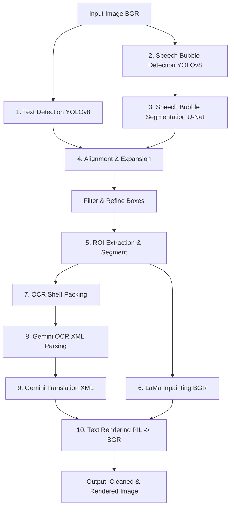

# ⛩️ Manga Translator

[](https://www.python.org/)
[](https://pixi.sh)
[](https://opensource.org/licenses/MIT)

An end-to-end, deep learning-powered manga and comic translation pipeline. It automatically detects, segments, erases (inpaints), transcribes, and re-renders translated text onto manga pages using high-performance object detection/segmentation networks combined with the **Google Gemini API**.

---

## 🗺️ Pipeline Architecture

The translation process flows through a modular, multi-stage pipeline designed for visual quality and transcription accuracy:



1. **Text Detection (YOLOv8):** Bounding boxes are localized around all text regions.
2. **Bubble Segmentation (YOLOv8 + U-Net):** Captures pixel-level shapes of speech bubbles.
3. **Geometric Alignment:** Correlates detected text regions to bubbles using Jaccard index (IoU) and expands rendering boundaries within bubble polygon masks.
4. **Text Erasure (MobileNetV4 + LaMa):** Segments text characters at pixel level and performs context-aware inpainting to restore the clean background.
5. **OCR Packing & Translation:** Packs cropped text regions onto a single labeled canvas with a shelf-packing algorithm. Sends a single batch request to Gemini with custom XML schemas for fast, cost-efficient transcription and translation.
6. **Adaptive Re-rendering:** Formats and draws the translated text centered vertically and horizontally within the expanded coordinates.

---

## ✨ Features

*   **⚡ Modern Package Management** — Fully integrated with **Pixi** for cross-platform, deterministic dependency resolution.
*   **🖼️ High-Quality Inpainting** — Leverages TorchScript-compiled **LaMa (Large Mask Inpainting)** fine-tuned on anime/manga art.
*   **🧠 Robust Attention Segmentation** — MobileNetV4 U-Net with **scSE attention blocks** and auxiliary deep supervision heads.
*   **📉 API Cost Optimization** — Combines multiple cropped text Regions of Interest (ROIs) onto a single shelf-packed canvas, reducing Gemini API calls and ensuring context-aware OCR.
*   **🛡️ XML-Structured LLM Protocol** — Uses solid, regular-expression-parsed XML tags for OCR and translations, eliminating formatting errors common with raw JSON prompts.
*   **🎨 Polygon-Constrained Text Expansion** — Dynamically grows text blocks outwards until they hit the contours of the speech bubble mask.

---

## 🚀 Quick Start

### 1. Installation

This project is built using [Pixi](https://pixi.sh). To set up the environment and download all dependencies automatically, simply install Pixi and run:

```bash
# Clone the repository
git clone https://github.com/daominhwysi/manga-translator.git
cd manga-translator

# Install dependencies and prepare virtual environment
pixi install
```

### 2. Environment Setup

Create a `.env` file in the root directory:

```env
GEMINI_API_KEY=your_google_gemini_api_key_here
GEMINI_MODEL_NAME=gemini-2.0-flash-lite  # Optional
```

### 3. Running the Pipeline

Translate any manga page instantly:

```bash
pixi run translate --image sample/image_0277_idx285_webp.jpg --target-lang English
```

---

## 🎨 Command Line Usage

Use the pipeline CLI via `pixi run translate` (or directly via `python src/pipeline.py` inside the activated env):

```bash
pixi run translate [OPTIONS]
```

### Options Reference

| Argument | Type | Default | Description |
| :--- | :---: | :---: | :--- |
| `--image` | `str` | `None` | Path to a single input image. |
| `--input-dir` | `str` | `None` | Process all supported images in this directory in batch. |
| `--output` | `str` | `output_dev` | Directory where output assets are saved. |
| `--models` | `str` | `checkpoints` | Directory storing neural network model weights. |
| `--source-lang`| `str` | `auto` | Language of the input text (e.g. `Japanese`, `auto`). |
| `--target-lang`| `str` | `English` | Target translation language. |
| `--no-seg` | `flag`| — | Disable text segmentation. |
| `--no-sb-det` | `flag`| — | Disable speech bubble bounding box detection. |
| `--no-sb-seg` | `flag`| — | Disable speech bubble pixel segmentation. |
| `--no-inp` | `flag`| — | Disable LaMa inpainting. |
| `--no-ocr` | `flag`| — | Disable Gemini OCR transcription. |
| `--no-translate`| `flag`| — | Disable text translation. |
| `--device` | `str` | `cuda` | Hardware execution backend (`cuda` or `cpu`). |

---

## 🤖 Programmatic API

You can import and run the modular pipeline within your own custom scripts:

```python
from src.pipeline import MangaTranslatorPipeline

# Initialize the pipeline components
pipeline = MangaTranslatorPipeline(
    model_dir="checkpoints",
    use_segmentation=True,
    use_sb_detection=True,
    use_sb_segmentation=True,
    use_inpainting=True,
    use_ocr=True,
    device="cuda"
)

# Run translation workflow
results = pipeline.process_image(
    image_path="sample/image_0277_idx285_webp.jpg",
    output_dir="output_dev"
)

print(f"Processed {results['detections']} text boxes!")
```

---

## 📁 Output Directory Layout

Pipeline execution outputs structured assets under your designated output folder:

```
output_dev/
├── text_detection/             # YOLOv8 bounding box plots
│   └── det_{filename}
├── text_segmentation/          # Isolated character masks and overlays
│   ├── mask_{filename}
│   └── overlay_{filename}
├── speech_bubble_segmentation/ # Speech bubble masks and overlays
│   ├── sb_mask_{filename}
│   └── sb_overlay_{filename}
├── inpainting_results/         # Cleaned background (text removed)
│   └── clean_{filename}
├── ocr_packing/                # Shelf-packed canvas and transcription text
│   ├── packed_ocr_{filename}
│   └── ocr_{filename}.txt
├── polygon_alignment/          # Geometric expansion debug mappings
│   └── poly_align_{filename}
└── translated/                 # Final translated text files and rendered images
    ├── translated_{filename}.txt
    └── rendered_{filename}
```

---

## 🧠 Model Checkpoints

Model checkpoints are hosted on GitHub Releases and are **automatically downloaded** on first execution.

| Component | Weights Checkpoint | Download Source |
| :--- | :--- | :--- |
| **Text Detection** | `text_det_yolo.onnx` | Trained YOLOv8 ONNX model |
| **Text Segmentation** | `text-segmentation.pth` | MobileNetV4 U-Net with scSE attention |
| **Bubble Detection** | `speech_bubble_detector.pt` | YOLOv8 PyTorch model |
| **Bubble Segmentation**| `mbnet_speech_bubble_seg.pth` | MobileNetV4 U-Net |
| **Inpainting** | `anime-manga-big-lama.pt` | LaMa model in TorchScript JIT format |

All URLs are managed in `src/configs/config.py` ([config.py](file:///d:/project/manga-translator/src/configs/config.py)).

---

## 🛠️ VS Code & Pyright Syncing

To ensure the VS Code language server resolves imports successfully, a `pyrightconfig.json` is bundled in the workspace:

```json
{
    "venvPath": ".pixi/envs",
    "venv": "default",
    "extraPaths": [
        "src"
    ]
}
```

---

## 📄 License

This project is licensed under the MIT License - see the [LICENSE](LICENSE) file for details.
