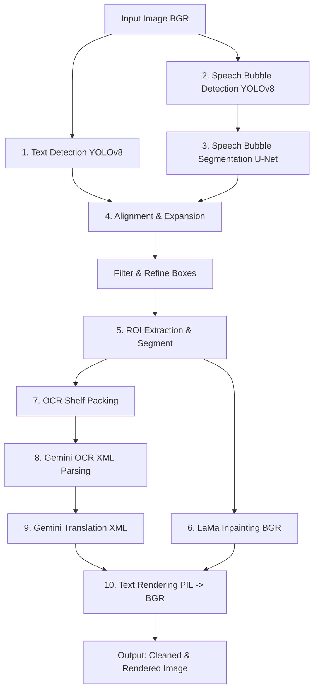

# Manga Translator - AI Agent Codebase Guide & Lookup Map

Welcome, Agent! This guide serves as your comprehensive context, architecture overview, and API lookup map for the `manga-translator` repository. Refer to this document to understand the codebase structure, pipeline flow, data shapes, interface signatures, and common extension patterns.

---

## 🗺️ Architectural Overview & Pipeline Flow

The project is an automated manga/comic translation pipeline. It operates sequentially across several AI/ML and heuristic components.

### Data Flow Diagram



### High-Level Component Pipeline
1. **Text Detection (YOLOv8 ONNX):** Detects bounding boxes for manga text regions.
2. **Speech Bubble Detection (YOLOv8 PyTorch):** Detects rough bounding boxes for speech bubbles.
3. **Speech Bubble Segmentation (U-Net):** Generates high-fidelity pixel-level masks for bubbles.
4. **Text Alignment & Expansion:** Matches detected text regions to their corresponding speech bubbles using Jaccard index (IoU). The text boxes are then progressively expanded outward inside the speech bubble's polygon mask to maximize the text rendering boundary.
5. **Text Segmentation & Inpainting (LaMa):** Performs pixel-level text segmentation and uses a Large Mask Inpainting model to clean the text regions, outputting a text-free background.
6. **OCR Shelf-Packing (Gemini API):** Crops text ROIs, packs them onto a single canvas with `TEXT_n` visual indices, and transcribes them in a single batch API call.
7. **XML Parsing & Translation (Gemini API):** Matches OCR transcriptions to their original indices, translates them, and parses the XML responses.
8. **Vertical/Horizontal Text Rendering:** Re-renders the translated text onto the inpainted background inside the expanded boxes.

---

## 📁 File Structure & Lookup Map

Use this directory map to locate specific logic instantly:

```
manga-translator/
├── .env                           # Local environment config (GEMINI_API_KEY)
├── pixi.toml                      # Pixi virtual environment configuration
├── pyrightconfig.json             # Pyright import resolution configuration
├── README.md                      # General setup and documentation
├── checkpoints/                   # Directory where downloaded weights are stored
├── sample/                        # Test images
├── output_dev/                    # Default pipeline run outputs
└── src/                           # Source directory
    ├── __init__.py
    ├── pipeline.py                # Main orchestrator class & CLI entry point
    ├── utils.py                   # Math, image drawing, weights downloading, and text alignment utilities
    ├── configs/
    │   ├── config.py              # Base config class & weight download URLs
    │   └── prompt_templates.py    # XML-based OCR and translation prompt templates
    ├── detection/
    │   ├── detector.py            # Abstract Base Class for detectors (BaseDetector)
    │   ├── manga_text_detector.py # TextDetector_YOLO class (ONNX-based text detection)
    │   └── speech_bubble_detector.py # SpeechBubbleDetector_YOLO class (speech bubble bounding boxes)
    ├── inpainting/
    │   └── lama_cleaner.py        # LamaCleaner class (TorchScript image inpainting with margin crops)
    ├── ocr/
    │   ├── gemini_ocr.py          # GeminiOCR class (Gemini SDK wrapper, XML parser, translation call)
    │   └── packing.py             # pack_rois function (shelf-packing visual label canvas creator)
    └── segmentation/
        ├── segmentor.py           # PyTorch U-Net models (MobileNetV4, EfficientViT) with attention modules
        ├── text_segmentor.py      # TextSegmentorMbnet class (U-Net text pixel segmenter)
        └── sb_segmentor.py        # SpeechBubbleSegmentorMbnet class (U-Net speech bubble pixel segmenter)
```

---

## ⚙️ Core Class Blueprints & Interfaces

### 1. `MangaTranslatorPipeline` ([pipeline.py](file:///d:/project/manga-translator/src/pipeline.py))
The primary orchestrator. Initialized with feature flags and manages model components.

```python
class MangaTranslatorPipeline:
    def __init__(
        self,
        model_dir: str = "checkpoints",
        use_segmentation: bool = True,
        use_sb_detection: bool = True,
        use_sb_segmentation: bool = True,
        use_inpainting: bool = True,
        use_ocr: bool = True,
        use_translation: bool = True,
        source_lang: str = "auto",
        target_lang: str = "English",
        device: str = "cuda"
    ):
        """Initializes and pre-loads configured neural networks to self.device."""

    def process_image(self, image_path: str, output_dir: str = "output_dev") -> dict:
        """Runs the entire multi-step pipeline on a single image file."""

    def process_directory(self, input_dir: str, output_dir: str = "output_dev") -> list:
        """Processes all supported images in a directory."""
```

### 2. Detectors ([src/detection/](file:///d:/project/manga-translator/src/detection/))
Both detectors inherit from `BaseDetector` ([detector.py](file:///d:/project/manga-translator/src/detection/detector.py)).

```python
class BaseDetector(ABC):
    @abstractmethod
    def load_model(self, model_path: str): pass

    @abstractmethod
    def detect(self, image: np.ndarray) -> List[Dict[str, Any]]:
        """Returns list of detections. Output format:
        [{'id': int, 'box': [x1, y1, x2, y2], 'label': str, 'conf': float}]
        """

    @staticmethod
    def sort_detections(detections: list, sort_by: str = "xy") -> list:
        """Sorts boxes by 'xy' (horizontal first) or 'yx' (vertical first)."""
```
- **`TextDetector_YOLO`** ([manga_text_detector.py](file:///d:/project/manga-translator/src/detection/manga_text_detector.py)): Loads `text_det_yolo.onnx` via Ultralytics YOLOv8.
- **`SpeechBubbleDetector_YOLO`** ([speech_bubble_detector.py](file:///d:/project/manga-translator/src/detection/speech_bubble_detector.py)): Loads `speech_bubble_detector.pt` via Ultralytics YOLOv8.

### 3. Segmentors ([src/segmentation/](file:///d:/project/manga-translator/src/segmentation/))
Wrappers around the `Unet_MobileNetV4` PyTorch architecture ([segmentor.py](file:///d:/project/manga-translator/src/segmentation/segmentor.py)).

```python
class TextSegmentorMbnet / SpeechBubbleSegmentorMbnet:
    def __init__(self, model_path: str, conf_threshold: float = 0.3, device="cuda"):
        """Loads U-Net weights, moves model to device."""

    def segment(self, image: np.ndarray) -> np.ndarray:
        """
        Input: BGR Image (np.ndarray)
        Process: Resizes to 256x256, converts to RGB, normalizes using ImageNet stats,
                 runs U-Net, thresholds prediction, resizes back.
        Output: Grayscale binary mask (0 or 255) of original size
        """
```

### 4. `LamaCleaner` ([lama_cleaner.py](file:///d:/project/manga-translator/src/inpainting/lama_cleaner.py))
Handles inpainting using TorchScript.

```python
class LamaCleaner:
    def __init__(self, model_path: str, device="cuda"):
        """Loads the TorchScript JIT compiled LaMa model."""

    def inpaint_with_crop(self, image_buffer: np.ndarray, mask_buffer: np.ndarray, margin: int = 128) -> PIL.Image:
        """
        Input: BGR Image (image_buffer), 3-Channel BGR Mask (mask_buffer)
        Process: Converts mask to single channel, calculates a bounding box around 
                 non-zero mask pixels, expands the bbox by a margin (forces multiples of 8), 
                 crops, feeds torch tensor to LaMa model, blends result.
        Output: PIL Image containing inpainted result.
        """
```

### 5. `GeminiOCR` ([gemini_ocr.py](file:///d:/project/manga-translator/src/ocr/gemini_ocr.py))
Manages the shelf-packing and XML translation workflows.

```python
class GeminiOCR:
    def __init__(self, api_key: str = None, model_name: str = Config.GEMINI_MODEL_NAME):
        """Initializes genai.Client using Google GenAI SDK."""

    def pack_rois(self, roi_list: list, padding=15, border_size=3) -> Tuple[PIL.Image, List[Dict]]:
        """Arranges cropped text ROIs onto a packed canvas. Delegates to packing.py."""

    def ocr_packed(self, image: PIL.Image) -> Dict[int, str]:
        """Sends packed canvas to Gemini OCR and parses XML response -> {visual_idx: text}."""

    def translate(self, texts: Dict[int, str], source_lang="auto", target_lang="English") -> Dict[int, str]:
        """Translates indexed texts using Gemini API with XML block formatting."""
```

---

## 📊 Data Formats & Coordinate Space Mapping

When writing new features, ensure you preserve these coordinate/color invariants:

### 1. Bounding Boxes
*   **Format:** `[x1, y1, x2, y2]` where `(x1, y1)` is the top-left corner, and `(x2, y2)` is the bottom-right corner.
*   **Coordinates:** Absolute pixel coordinates relative to the original image dimensions.
*   **Type:** Floats/Integers. Ensure you cast to `int` when slicing images: `img[y1:y2, x1:x2]`.

### 2. Image Color Spaces
*   **Pipeline OpenCV:** Uses standard BGR (`cv2.imread`).
*   **PyTorch Models (Segmentor, Inpainter):** Expect RGB. Preprocessing handles BGR-to-RGB conversion.
*   **Gemini/PIL:** Expects RGB. The pipeline handles conversion before packing and calling the Gemini SDK.

### 3. Shelf-Packing Coordinate Layout
In `src/ocr/packing.py` ([packing.py](file:///d:/project/manga-translator/src/ocr/packing.py)):
1. Text ROIs are cropped from the original image.
2. A black border is added (`border_size = 3`).
3. A visual label `TEXT_n` is printed underneath each crop (`label_area_height`).
4. ROIs are sorted by height (descending) and packed using a **Shelf-Packing algorithm** onto a clean white canvas.
5. Visual indices (`TEXT_0`, `TEXT_1`, etc.) are assigned based on their layout position (**top-to-bottom, left-to-right**).
6. A mapping is returned containing:
    ```python
    {
        "visual_idx": int,      # The new index labeled on the packed canvas (sent to Gemini)
        "original_idx": int,    # The index corresponding to the sorted detections list
        "box_in_packed": list   # [x1, y1, x2, y2] placement coordinates on the packed canvas
    }
    ```

---

## ✉️ XML Prompt & Communication Protocol

To ensure extremely reliable batch transcription and translation, the codebase uses structured XML prompts instead of JSON. This minimizes parsing errors due to quotation marks, newlines, and escaping.

### OCR Packed Prompt
Gemini receives a single packed canvas with the following XML prompt:
```
The image contains multiple text boxes labeled with red text 'TEXT_0', 'TEXT_1', etc.
Please transcribe the content of each text box accurately.
Format your response EXACTLY as XML:
<transcriptions>
  <text id="0">transcription of TEXT_0</text>
  <text id="1">transcription of TEXT_1</text>
  ...
</transcriptions>
Do not include any other text in your response.
```

### Translation Prompt ([prompt_templates.py](file:///d:/project/manga-translator/src/configs/prompt_templates.py))
Gemini receives the transcribed texts block formatted in XML:
```xml
You are a manga translation assistant. Translate the following text from {source_lang} to {target_lang}.
Preserve the original meaning, tone, and style. Keep sound effects onomatopoeic.
...
<translations>
  <text id="0">translated text 0</text>
  <text id="1">translated text 1</text>
</translations>
```
The parser `GeminiOCR.parse_xml_response()` utilizes a robust regular expression (`r'<text\s+id=["\']?(\d+)["\']?>(.*?)</text>'`) with `re.DOTALL` to parse the indices and values cleanly regardless of code block formatting or spacing.

---

## 🛠️ Environment Configuration & Pyright Syncing

### Pixi Environment
The project environment is managed via **Pixi** (`pixi.toml` -> `.pixi/envs/default`). To run scripts or pipelines inside the environment:
```bash
pixi run translate --image sample/image_0277_idx285_webp.jpg --target-lang Vietnamese
```
Or prefix any Python command with `pixi run python ...`.

### VS Code Pyright Syncing
To prevent missing import errors in VS Code (such as PyTorch, OpenCV, or Ultralytics), `pyrightconfig.json` is set to resolve imports from the Pixi environment:
```json
{
    "venvPath": ".pixi/envs",
    "venv": "default",
    "extraPaths": [
        "src"
    ]
}
```

### Model Checkpoints
Weights are automatically downloaded from Github Releases on first use:
- Directory: `checkpoints/`
- Text Detection: `checkpoints/text_det_yolo.onnx`
- Text Segmentation: `checkpoints/text-segmentation.pth` (MobileNetV4 U-Net)
- Speech Bubble Detection: `checkpoints/speech_bubble_detector.pt` (YOLOv8)
- Speech Bubble Segmentation: `checkpoints/mbnet_speech_bubble_seg.pth`
- Inpainting: `checkpoints/anime-manga-big-lama.pt` (TorchScript)

---

## 💡 Developer Extension Recipes

### 1. Swapping/Fine-Tuning a Segmentation Model
To modify or replace the U-Net segmentation models (e.g. swap from MobileNetV4 to EfficientViT):
1. Navigate to `src/segmentation/segmentor.py` ([segmentor.py](file:///d:/project/manga-translator/src/segmentation/segmentor.py)).
2. Observe `Unet_MobileNetV4` and `Unet_EfficientViT_B2` architectures.
3. Update `load_model` inside `text_segmentor.py` or `sb_segmentor.py` to initialize your desired model class and load the respective `.pth` weights.

### 2. Modifying Text Expansion Behavior
If you need to optimize how text boxes are expanded within speech bubbles:
1. Open `src/utils.py` ([utils.py](file:///d:/project/manga-translator/src/utils.py)).
2. Locate `expand_text_box_in_mask()`.
3. Adjust the step-based expanding loop (`step = 2`), or introduce padding margins to the returned coordinates.

### 3. Modifying Rendering Aesthetics
Text is drawn on the image dynamically:
1. Open `src/utils.py` ([utils.py](file:///d:/project/manga-translator/src/utils.py)).
2. Locate `render_text_on_image()`.
3. The function calculates optimal font size iteratively from high to low. You can customize font list priorities, spacing, text color, outline borders, or vertical centering heuristics here.

---

## 🔍 Pipeline Execution Quick Reference

```bash
# Process a single image
pixi run python src/pipeline.py --image sample/image_0277_idx285_webp.jpg --output output_dev

# Run with customized source and target languages
pixi run python src/pipeline.py --image sample/image_0277_idx285_webp.jpg --source-lang auto --target-lang Japanese

# Process a directory of manga pages
pixi run python src/pipeline.py --input-dir sample --output output_dev

# Run with CPU if CUDA is unavailable
pixi run python src/pipeline.py --image sample/image_0277_idx285_webp.jpg --device cpu
```

Happy coding! If you run into any issues, verify that your `.env` contains a valid `GEMINI_API_KEY` and your Pyright is active.
